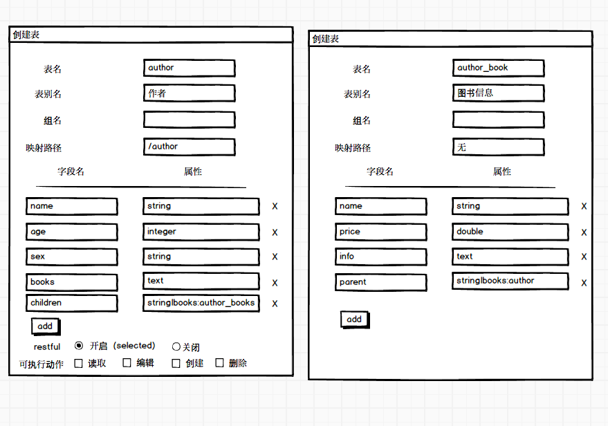
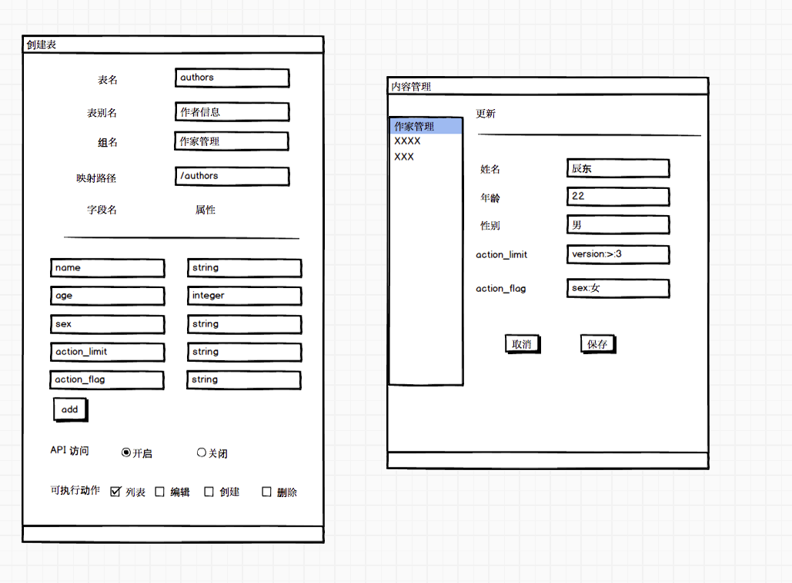

# 风云变

随着少侠修为越发提高,会需要更加上乘的武功心法来驰骋江湖,在这里我们将介绍表管理中一些高阶功能,助少侠一臂之力


## 数据模板

 有时你想要接口输出的数据来源于多张表 表然后按照顺序（模板）输出，这个你只需要再新建一张表，只填写一个`template text` 即可，然后在表单中具体的设置具体的表的顺序即可（表单的我们会在下篇介绍）

## 集合关系

  `像学校和班级,班级和个人,作者和书本,这种嵌套关系我们叫做集合关系`


``` javascript
// 假设我们需要一个API，这个API返回一个作者下面所有个人书籍的信息，结构大致如下

"author":{
 "name": "xxx",
 "age":  "xxx",
 "sex":  "xxx",
 "books": [
    {
        "name":  "xxx",
        "price": "xxx",
        "info":  "xxx".
    },
    {
        "name":  "xxx",
        "price": "xxx",
        "info":  "xxx".
    },
    ......
   ]
}

这种嵌套解构，我们称为集合关系
```

像这种集合关系你需要2张表author 和 author_book，加上2个特殊字段即可搞定，没错我们就是利用的`默认值`的功能
```
主表也叫父表(author)在author中加入
children string|books:author_books;
books text;
从表也叫字表(author_books)中加入
parent string|books:author
 ```
在这种情况下 请在`父表`加上 `children` 字段,内容为 `当前表的字段名:外键表的表名`

同时请在`子表`加上 `parent` 字段, 内容为 `主表字段名:主表表名`，但是要注意一点属性`不支持text`类型；

讲到这里，有的少侠可能已经晕乎了，不要着急，让我们一看便知：





## 输出控制
少侠如果你看到这里，恭喜已经打卡任督二脉中的一脉了，让我们一鼓作气，继续挑战吧！


有时候我们希望 API 的一些数据会根据传入的参数的变化而变化
比如我们期望一些数据在早期版本(早先已经发出去的版本无法解析这些新数据)但是在新的版本可以正常出现,这种情况就是输出控制最佳的用处

```
假设我们有一个水果的接口,会输出现有的水果
 http://domain/fruits?version=1.0
{
  code:1
  message:success
  data:{
    apple,
    orange,
    banana,
  }
}


假设后来我们加入了watermelon,希望 version 小于2的都看不到这个数据并且不会对原来的数据产生影响

 http://domain/fruits?version=2.0
{
  code:1
  message:success
  data:{
    apple,
    orange,
    banana,
    watermelon
  }
}

 http://domain/fruits?version=1.0
{
  code:1
  message:success
  data:{
    apple,
    orange,
    banana,
  }
}

```


这里会略微复杂，因为需要2个字段来完成功能，在建表填写字段的时候需要加上`action_limit`和`action_flag` 2个字段

*  action_limit	输出限定条件,参数名:操作符:值 例如 ：version:<:2 ，version 参数小于2 ,目前支持的操作符有 >,<,=,>=,<=,目前不支持多条件

*  action_flag	输出限定动作,display(不显示) 或者 title:1 (设定title =1 ，目前不支持多动作，和多条件）

让我们还是举个例子说明：
``` javascript


//假设这个接口的请求地址是这样的：
http://domain/xxx?format=json&version=1&token=k23ds3a8d55ka/dsd
// 请允许我向这些这些作者致敬

{
  code:1
  message:success
  data:{
  author:[
    {
      name: 辰东,
      age：  xxx,
      sex:  男,
    },
    {
      name: 跳舞,
      age：  xxx,
      sex:  男,
    },
    {
      name: 方想,
      age：  xxx,
      sex:  男,
    },
    ... ...
   ]
  }
}

1. 对所有数据做限定 ：如果我们希望当 `version` 这个参数大于3的时候，把所有的作者的性别都改成女（-，-！）你只需要在在填写这些字段时候加上默认值
    ‘action_limit string|version:>:3’
    ‘action_flag  string|sex:女’
    然后你重新刷新下接口调用，神奇的一幕就发生了，所有的sex 都变成女了，

2. 对特定的数据做限定，如果我们希望当 `version` 这个参数大于3的时候，把辰东的性别都改成女（这不是长生界的残怨！），注意这里不要加默认值：直接添加这2个字段就好
`action_limit string`
`action_flag  string`

大致如下图所示
```

