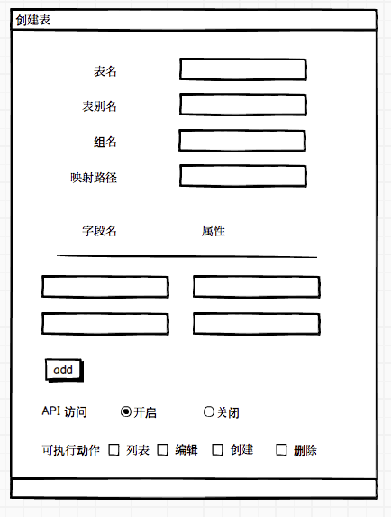
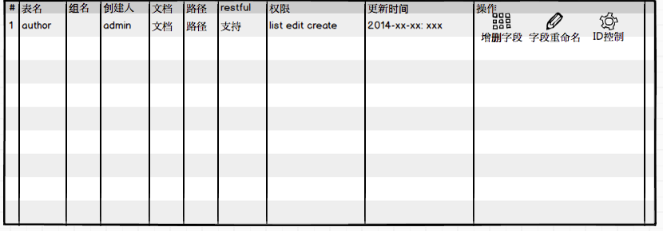

#表格管理


## 创建表

 表基石也！指的是数据库中的表(table)，是数据真正存储的地方。通过我们系统可以让少侠快速的把数据和数据库关联起来，即使少侠一点也不会数据库的知识也没关系，当然会了更好！

在所有的编程武功中都有字符串（string）和数字之分（int），我们的系统也不例外，理论上所有的类型都可以用string，但是这样在客户端解析和数据存储来看
并不不是最上乘。

数据是一个系统的基石，所以这篇我们会着重介绍，如果少侠看的不知所云，那就稍后可以参照我们最后的实践例子，少侠一试便知！

界面大概是这个样子，我知道很丑，如果有更好的设计欢迎联系我们，一经采用，千金相酬


## 界面术语


   * 表名顾名思义表的名称，支持字母，数字和下划线，请不要使用中文和特殊字符，必填
   * 表别名，表的艺名（因为表名大部分是英文和字母，这个地方就可以填写中文啦），在内容管理中显示所用，可以使用中文，必填
   * 组名， 在内容管理中的分组名称，方便显示，可选
   * 映射路径， 在路径管理中我们介绍的，把数据和URL 地址关联起来，如果不希望这个表的数据被外界访问可以选无
   * 字段名 字母数字和下划线构成，这个就是API访问的的字段名称
   * 属性   字段的类型，一旦确定不可修改，稍后我们为少侠详细介绍
   * 如果需要这张表的数据以API的方式对外提供，那么需要选择路径映射，并且勾起`restful` ，然后选择对应的权限


## 初出茅庐


   字段就是数据实体（API）返回的一些字段，属性就是这些字段的类型，字段和属性在实际并无一一对应关系

   这里我们讲介绍系统的4大基础属性，掌握了这些基础字段，就可以尝试建立一些常规的接口，给客户端使用。

* 第一式 `string` 适用于标题，名称，图片等中短文本类型，string 支持长度设定默认是45个字符，你可以通过 string N （N>0）来增加默认的文本长度,如果输入的文本超过了默认长度限定
数据将会被默认截断，如果你实在不知道用多长合适那就直接用 `string 200` 吧

* 第二式 `text` 适用于大型文本， 例如文章，简介等，这个不能指定长度

* 第三式 `integer` 适用于各种id，但是有一点要注意数据的长度不要超过11位 或者数值在 -2^31 (-2,147,483,648) 到 2^31 – 1 (2,147,483,647)之间，不然数据会不正常的，然后你整个人就不好了。对于含有小数点的可以用double或者decimal

* 第四式 `datetime`  适用于时间返回的格式 yyyy-mm-dd h:i:s 例如（2014-04-21 12:00:00）


### 举个简单的示例


这里我们创建了一个books 表，绑定了在前面创建的books 路径，然后填写了一个string 类型的name，和一个integer类型的price（这个地方用double更加合适，让我偷下小懒吧），并且开启的restful 访问,并且在后面添加了数据

那么我们API访问将会是这样

```
http://domain/books
{
  "code": 1
  "message": "successful"
  "data":[
   {
      "id" : 1,
      "name" : "三国演义"，
      "price": 30
   },
   {
      "id" : 2,
      "name" : "水浒传"，
      "price": 20
   },
   ... ...
  ]
}
```

更加强力的API 我们讲在稍后细致的介绍，少侠勿急

## 登堂入室

恭喜少侠已经可以出入江湖了，去围观下武林大赛什么的，倘若想去一争搞下，你需要更厉害的上乘功法，这个请少侠放心，勿需自宫，也不要998，只需要耐心往下看即可

* 系统内置字段 当你建表的时候系统会默认加上`id,user_name，timing_state，timing_time，created_at，updated_at，deleted_at` 这些字段，所以
你新增字段的时候不能使用这些字段，这些字段的数据都是自动记录所以你可以放心使用

* 数据的默认值 倘若你需要一个字在创建的时候就有一个默认值，那么你只需要用`|` 即可
例如 `img string 200 ` ,这里我们创建了一个长度为200的img字段，若img创建的时候希望有一个xxx.png的默认值，那么创建的时候可以这样 `img string 200|xxx.png`
这个会在后面有妙用，请少侠牢记

* 数据模板 有时你想要让数据来自于多张表然后按照顺序（模板）输出，这个你只需要再新建一张表，只填写一个`template text` 即可，然后在表单中具体的设置具体的表的顺序即可（表单的我们会在下篇介绍）

* 集合关系输出，在现实场景中你经常会需要接口返回集合数据,请在
`父表`加上 `children` 字段,内容为 `当前表的字段名:外键表的表名`,
同时请在`子属`表加上 `parent` 字段, 内容为 `主表字段名:主表表名`，但是要注意一点属性`不支持text`类型；

讲到这里，有的少侠可能已经晕乎了，不要着急，让我们来举个例子少侠一看便知：

``` javascript
// 假设我们需要一个API，这个API返回一个作者下面所有个人书籍的信息，结构大致如下

"author":{
 "name": "xxx",
 "age":  "xxx",
 "sex":  "xxx",
 "books": [
    {
        "name":  "xxx",
        "price": "xxx",
        "info":  "xxx".
    },
    {
        "name":  "xxx",
        "price": "xxx",
        "info":  "xxx".
    },
    ......
   ]
}

这种嵌套解构，我们称为集合关系
像这种集合关系你需要2张表author 和 author_book，加上2个特殊字段即可搞定，没错我们就是利用的默认值的功能
第一张表(author)在author中加入
children string|books:author_books;
books text;
然后在第二张表(author_books)中加入
parent string|books:author

```


少侠如果你看到这里，恭喜已经打卡任督二脉中的一脉了，让我们一鼓作气，继续挑战吧！


* 限定条件输出（版本控制）,这里的版本控制不是指代码的vcs，而是API输出的版本控制。在很多场景下会有api升级后需要向下兼容的情况，希望api 的数据针对不同的版本输出不同的内容
例如有些数据对低版本的客户端不输出等，当然地方是可选的，如果少侠没有版本控制的困恼可以跳过这个地方，不会影响系统的正常使用，只是掌握了它你可以更灵活的控制API 升级

这里会略微复杂，因为需要2个字段来完成功能，在建表填写字段的时候需要加上`action_limit`和`action_flag` 2个字段

*  action_limit	输出限定条件,参数名:操作符:值 例如 ：version:<:3 ，version 参数小于3 ,目前支持的操作符有 >,<,=,>=,<=,目前不支持多条件

*  action_flag	输出限定动作,display(不显示) 或者 title:1 (设定title =1 ，目前不支持多动作，和托条件）

让我们还是举个例子说明：
``` javascript


//假设这个接口的请求地址是这样的：http://www.xxxx.com/xxx?format=json&version=1&token=k23ds3a8d55ka/dsd
// 请允许我向这些这些作者致敬

{
  code:1
  message:success
  data:{
  author:[
    {
      name: 辰东,
      age：  xxx,
      sex:  男,
    },
    {
      name: 跳舞,
      age：  xxx,
      sex:  男,
    },
    {
      name: 方想,
      age：  xxx,
      sex:  男,
    },
    ... ...
   ]
  }
}

1. 对所有数据做限定 ：如果我们希望当 `version` 这个参数大于3的时候，把所有的作者的性别都改成女（-，-！）你只需要在在填写这些字段时候加上默认值
    ‘action_limit string|version:>:3’
    ‘action_flag  string|sex:女’
    然后你重新刷新下接口调用，神奇的一幕就发生了，所有的sex 都变成女了，

2. 对特定的数据做限定，如果我们希望当 `version` 这个参数大于3的时候，把辰东的性别都改成女（这不是长生界的残怨！），注意这里不要加默认值：直接添加这2个字段就好
`action_limit string`
`action_flag  string`

然后在数据编辑界面对应的数据中填写值即可，这个数据编辑界面我们在稍后的文档中会介绍，这里只要少侠记住这个概念即可

```


## 江湖的传说

到了这里恭喜少侠已经经过了最艰难的旅途，可以开创属于自己的江湖传说了，不过闯荡江湖前，少侠需做充分的准备，不然传说就会变成小说了

* 表一旦建立成功，不允许删除,删除太危险，就像投胎重生
* 在表列表界面允许在此新增字段只要补重名就好
* 表的字段名字填写错了没有关系可以在后面的地方修改，但是表的类型一旦建立就不允许修改
* 每个表都有一个主键和索引一般都是数据的ID，根据ID来查数据是飞一般的速度

`同时我们也回顾下这些有特殊意义的字段，归纳和整理是很重要的`


|关键字|说明|示例|
|------|---|---|
|ID|数据唯一标示|1
|deleted_at|删除时间|2013-12-17 10:41:34
|updated_at|更新时间|2013-12-17 10:41:34
|created_at|创建时间|2013-12-17 10:41:34
|timing_time|数据定时时间|2013-12-17 10:41:34
|timing_state|数据状态|1
|user_name|修改人|xxxx
|children| 集合属性|videos:special_video(字段:表名)
|parent| 集合属性|videos:special:1(字段:表名:id)
|rank| 排序|1395373666
|template| 模板|表名，表名
|action_limit| 输出限定条件 |version:<:3 (version 参数小于3),支持<,>,=,<=,>=
|action_flag| 输出限定动作 | display(不显示) 或者 title:1 (设定title =1)

## 表列表

   在表列表界面我们会看到我们创建的表的信息，有这个表的调用方式（如果绑定了路径的话），访问权限和表的属性结构等，同时在这个地方我们可以新增字段，
   修改字段名,这些地方和前面的一样，少侠一试便知



